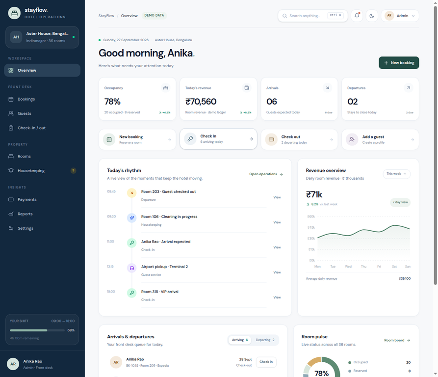
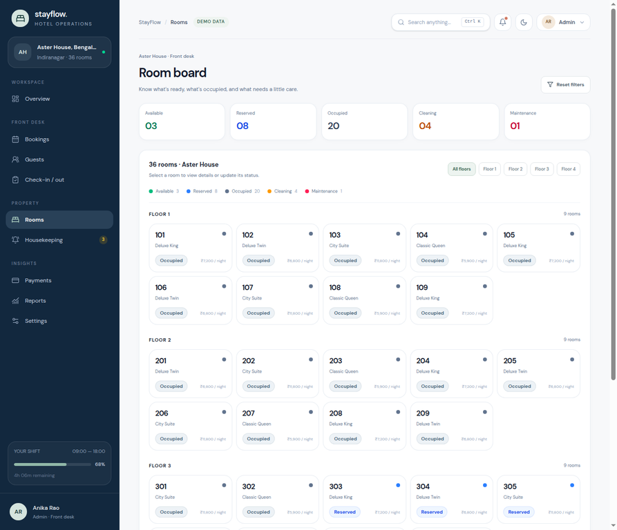
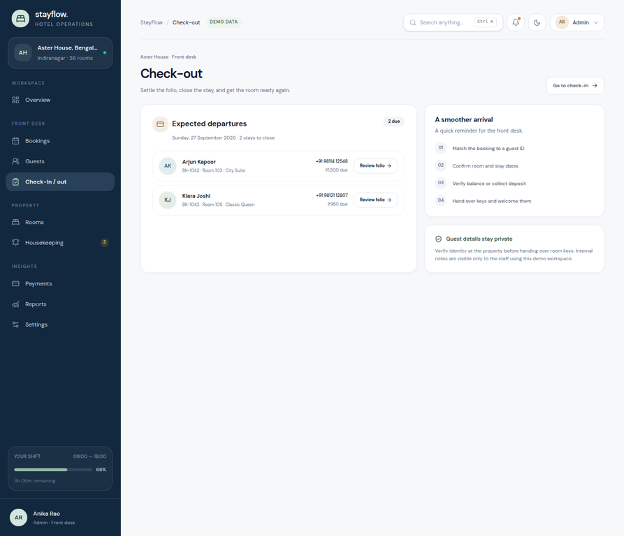
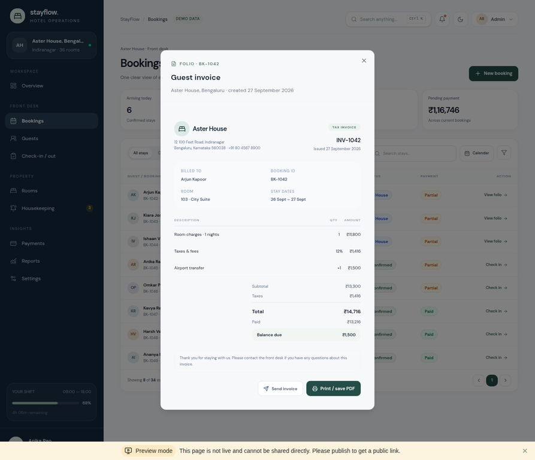

# StayFlow — Hotel Operations

A hospitality operations dashboard prototype for a 36-room boutique hotel. StayFlow brings the front desk, rooms, guests, housekeeping, folios, and management reporting into one responsive workspace.

> **Status: interactive portfolio demo, not production-ready hotel software.** Operational records are browser-local demo data. The hotel-domain database schema, server-side authorization, real payment collection, and email delivery are not implemented. Do not enter real guest or payment data.

## Live preview

[Open the StayFlow preview](https://3000-iol9w4zqsyssh6z2tcfmv-605f8e07.sg2.manus.computer/)

## Screenshots

### Operations dashboard



### Room board



### Front-desk checkout



### Service-inclusive guest invoice



## What works in the demo

- **Daily dashboard:** occupancy, revenue, arrival and departure queues, room pulse, and quick actions.
- **Bookings:** date-aware room availability, overlap checks, booking quotes, booking list filters, and guest lookup.
- **Guestbook:** guest profiles, contact details, stay history, preference notes, and guest creation.
- **Front desk:** check-in and checkout workflows, payment status, and a folio that gates checkout until the outstanding demo balance is settled.
- **Services and folios:** a small hotel-services catalogue; service orders increase the folio, appear as itemized charges, and reconcile with room taxes in the invoice.
- **Rooms and housekeeping:** a 36-room board, status changes, housekeeping tasks, and checkout-to-cleaning handoff.
- **Operations polish:** responsive navigation, light/dark themes, keyboard shortcuts, notifications, reports, and a role-switching preview.
- **Invoice output:** browser **Print / save PDF** uses the print stylesheet. **Send invoice** is intentionally a demo-only message; no email is sent.

The seeded workspace contains 36 rooms, 52 guest profiles, 34 bookings, housekeeping tasks, notifications, and sample service orders. Changes persist only in the current browser through `localStorage` (`stayflow-demo-workspace-v4`). Clearing that key restores the starter fixture.

## Design and implementation

The UI uses a quiet hospitality palette—deep teal navigation, warm neutral surfaces, and muted botanical greens—with compact operational tables, high-contrast status cues, and responsive layouts. Motion is restrained to short interaction transitions.

### Stack

- React 19, TypeScript, Vite
- Tailwind CSS 4, Radix/shadcn-style components, Lucide icons
- Recharts for demo reporting visualizations
- Scaffolded Express 4 + tRPC 11 + Drizzle ORM + MySQL/TiDB
- Scaffolded Manus OAuth/session plumbing

**Important architecture boundary:** the scaffolded database currently backs the auth `users` table only. The StayFlow rooms, guests, bookings, services, payments, housekeeping, invoices, and notifications shown in the UI are demo objects stored in browser `localStorage`; the hotel operations UI is not connected to tRPC or the database yet. The visible role switch is for portfolio demonstration and does not enforce server permissions.

## Run locally

Requirements: Node.js 22 and pnpm 10.

```bash
pnpm install
pnpm dev
```

Useful checks:

```bash
pnpm check
pnpm test
pnpm build
```

For the scaffolded authentication/database server, configure secrets through the managed environment rather than committing them. The base scaffold expects `DATABASE_URL`, `JWT_SECRET`, `VITE_APP_ID`, `OAUTH_SERVER_URL`, `VITE_OAUTH_PORTAL_URL`, `OWNER_OPEN_ID`, and `OWNER_NAME`. No demo password is shipped; the current app content is sample data and the scaffold's sign-in is Manus OAuth.

## Verification

- `pnpm check` — passed
- `pnpm test` — passed (8 tests across the auth logout and hotel booking/folio utility suites)
- `pnpm build` — passed
- Browser preview journey exercised: check-in → add a service → collect the outstanding balance → checkout → housekeeping handoff; service charges and invoice totals were inspected.

The production build currently emits a Vite warning that the main JavaScript chunk exceeds 500 kB. See [`todo.md`](todo.md) for this and the remaining implementation work.

## Production-readiness work remaining

Before this can be used by a real property, add property-scoped relational tables and migrations; connect all operational reads/writes to protected tRPC procedures; enforce tenant and staff-role authorization on the server; implement transactional room availability checks and audit trails; replace browser-only storage; integrate a real payment provider and email service; and validate invoicing, local tax, privacy, retention, backups, monitoring, and recovery requirements for the target jurisdiction.

## Author

Portfolio project. Replace this section with your name, GitHub profile, and portfolio links before publishing.

## License

No license has been selected yet. Add a `LICENSE` file before redistributing the project.
